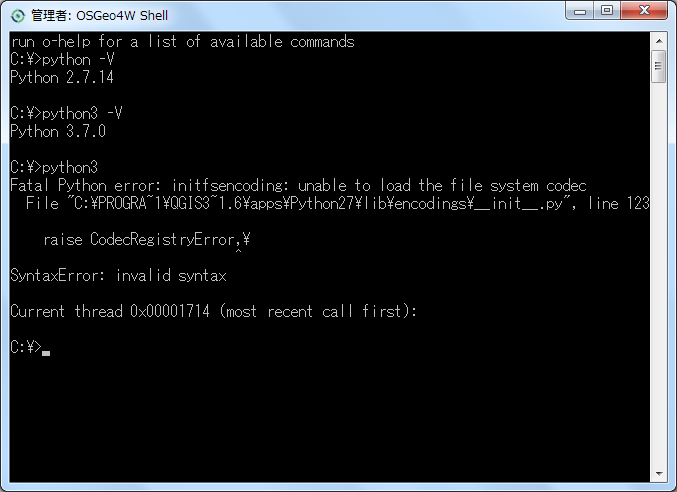
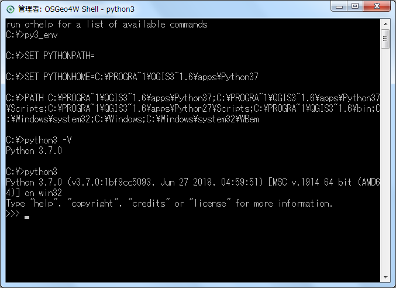
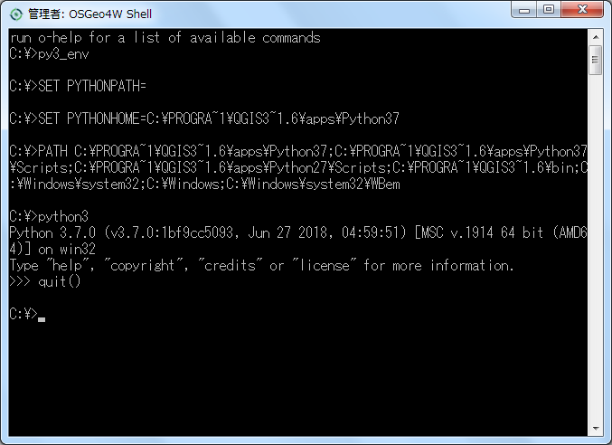

# Learning Python

---

### 目標

- 完全に理解しようとしない。
- どんなことができるのか漠然と理解する。
- リファレンスの使い方を覚える。
- 文字列とリストの扱いを中心とし、今回は numpy や pandas といった便利ツールは使わない。

---

### 環境のインストール

いろいろな方法がある。データサイエンス関係では Anaconda でインストールする例もよくみかける。

ここでは、敢えて Windows 版 QGIS 3.x をインストールしたときに一緒にインストールされる Python 3.x を使うことにする。

Mac や Linux は簡単にインストールすることができる、あるいはデフォルトでインストール済みなので、そのまま使おう。

---

### OSGeo4W Shell から Python の実行

スタートメニューから「 QGIS 3.6 」→「 OSGeo4W Shell 」を実行すると OSGeo4W Shell という名のコマンドプロンプトが起動される。

OSGeo4W Shell では `C:\Program Files\QGIS 3.6\bin` を検索パスに追加等の設定がなされており、 GDAL/OGR などのコマンドが使用できるようになっている。

---

### OSGeo4W Shell から Python の実行

`python` (Python 2.7) や `python3` (Python 3.x) にもパスは通っているが、 Python 関係で必要な設定が不十分でエラーが発生する。

---

### OSGeo4W Shell から Python の実行

そこで `py3_env.bat` を実行すると、自動的に必要な設定が行われる。

---

### Python の対話モード

`python3` あるいは `python` コマンドを引数なしで実行すると対話モードで起動される。ちょっとした動作の確認や、簡単なスクリプトの実行なら対話モードでよい。対話モードの Python を終了するには `quit()` を実行する。

---

### Python スクリプトの実行

`python3 SCRIPT_FILE` と実行すると、スクリプトファイルが処理される。

---

